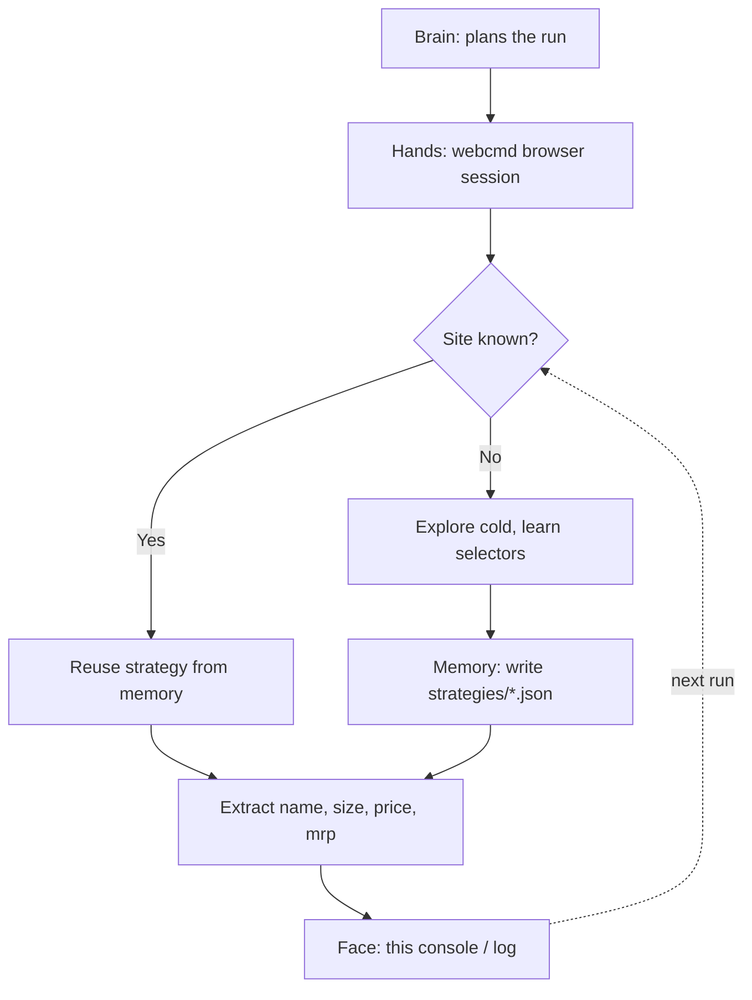

# Basket Buddy

**A browser agent that learns a platform once and reuses the lesson, proven across four real quick-commerce sites, including one it had never touched before going live.**

Built solo for **SLAB Hackathon** (Self Learning Agent Browser), Track 05, Self-Learning Loops. Built entirely on [WebCMD](https://github.com/agentrhq/webcmd).

Fork of WebCMD: https://github.com/victorisaacchinta-eng/webcmd

---

## The 30-second version

Every platform this agent touches gets harder to fool the second time. Blinkit took 6 real attempts to crack, cold. By the time it reached District, a site it had zero prior exposure to, it worked first try, live, on stage.

| Platform | Attempts | Outcome |
|---|---|---|
| Blinkit | 6 | cold start, no strategy existed yet |
| BigBasket | 2 | blocked (real 404, likely bot-detection), correctly abandoned |
| Amazon | 1 | reused "verify the direct search URL before touching the DOM" |
| Zepto | 2 | URL worked first try, one fix for discount-badge noise |
| **District** | **1** | **transfer test, zero prior exposure, live** |

Full detail: [`learning_log.json`](./learning_log.json)

---

## How we use WebCMD

Every browser action in this project runs through a WebCMD session, no raw Playwright or Selenium script drives anything directly.

- **Live browser control**: every navigate, click, type, and extract call is `webcmd browser run`, scoped to a `--profile`/`--session` pair per platform (`blinkit`, `amazon`, `zepto`, `bigbasket`, `district`). Nothing bypasses WebCMD.
- **Sitemap memory**: WebCMD's own explore-once-reuse layer is what makes the second and later runs on a platform faster than the first, that's the mechanic the whole attempt-count table above is measuring.
- **Our layer on top**: a strategy store (`strategies/*.json`), one file per platform, written after each run with what was learned, e.g. the real search URL pattern, selector notes, and gotchas. This is task-level memory (what worked, what didn't), separate from and built on top of WebCMD's own site-structure memory.
- **Profiles and sessions**: each platform gets its own throwaway profile
cd ~/basket-buddy
cat > README.md << 'EOF'
# Basket Buddy

**A browser agent that learns a platform once and reuses the lesson, proven across four real quick-commerce sites, including one it had never touched before going live.**

Built solo for **SLAB Hackathon** (Self Learning Agent Browser), Track 05, Self-Learning Loops. Built entirely on [WebCMD](https://github.com/agentrhq/webcmd).

Fork of WebCMD: https://github.com/victorisaacchinta-eng/webcmd

---

## The 30-second version

Every platform this agent touches gets harder to fool the second time. Blinkit took 6 real attempts to crack, cold. By the time it reached District, a site it had zero prior exposure to, it worked first try, live, on stage.

| Platform | Attempts | Outcome |
|---|---|---|
| Blinkit | 6 | cold start, no strategy existed yet |
| BigBasket | 2 | blocked (real 404, likely bot-detection), correctly abandoned |
| Amazon | 1 | reused "verify the direct search URL before touching the DOM" |
| Zepto | 2 | URL worked first try, one fix for discount-badge noise |
| **District** | **1** | **transfer test, zero prior exposure, live** |

Full detail: [`learning_log.json`](./learning_log.json)

---

## How we use WebCMD

Every browser action in this project runs through a WebCMD session, no raw Playwright or Selenium script drives anything directly.

- **Live browser control**: every navigate, click, type, and extract call is `webcmd browser run`, scoped to a `--profile`/`--session` pair per platform (`blinkit`, `amazon`, `zepto`, `bigbasket`, `district`). Nothing bypasses WebCMD.
- **Sitemap memory**: WebCMD's own explore-once-reuse layer is what makes the second and later runs on a platform faster than the first, that's the mechanic the whole attempt-count table above is measuring.
- **Our layer on top**: a strategy store (`strategies/*.json`), one file per platform, written after each run with what was learned, e.g. the real search URL pattern, selector notes, and gotchas. This is task-level memory (what worked, what didn't), separate from and built on top of WebCMD's own site-structure memory.
- **Profiles and sessions**: each platform gets its own throwaway profile and explicit session, created and closed per WebCMD's own model, nothing shared across platforms.

## How it's built



## Guardrails, not an afterthought

- Every run stops at read-only extraction. No checkout, no payment, no real account action.
- Human confirmation required before anything irreversible, per the event's own rule.
- A blocked platform (BigBasket) was logged and abandoned, not retried indefinitely or worked around.
- Throwaway profiles only, no cookies or credentials committed to this repo.

## Quick start

```bash
npm install -g @agentrhq/webcmd
webcmd doctor              # must be green
webcmd skills add          # choose Claude when prompted

webcmd profile create <platform>
webcmd --profile <platform> session create <platform>-main -f json
# log in manually in the Chrome window that opens, if the platform needs it

webcmd --profile <platform> --session <session-id> browser run --file <platform>_search.js
```

Each `<platform>_search.js` is a self-contained extraction script. Strategy files in `strategies/` document what was learned per platform and why.

## What's real vs. illustrative

Everything in `learning_log.json` and `strategies/` is a direct record of what happened during this build, not simulated. Attempt counts are literal iteration counts, not estimates.

## Stack

Claude, WebCMD, plain Node scripts run through `webcmd browser run`. No other browser automation library.

## Track compliance

- [x] Built entirely on WebCMD, every browser action goes through a `webcmd` session
- [x] Forked and starred agentrhq/webcmd: https://github.com/victorisaacchinta-eng/webcmd
- [x] Public repo with README, architecture, APIs declared, and this "How we use WebCMD" section
- [x] Action logs from full runs (`learning_log.json`, `strategies/*.json`)
- [ ] 2-3 min backup demo video
- [ ] One-page write-up
- [x] Task family with 5+ variants attempted (4 succeeded, 1 documented block)
- [x] Transfer test on a genuinely unseen variant (District)
- [x] Safe adaptation: guardrails enforced in code, not just described
- [x] No cookies, profile data, or credentials committed

## Author

Victor Isaac, ACE Engineering College, Hyderabad. Built solo.
